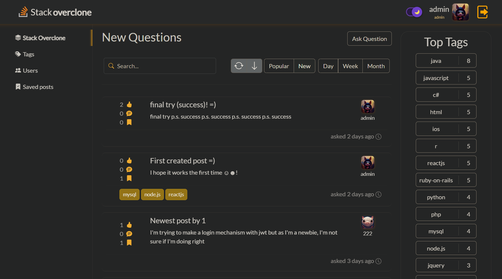
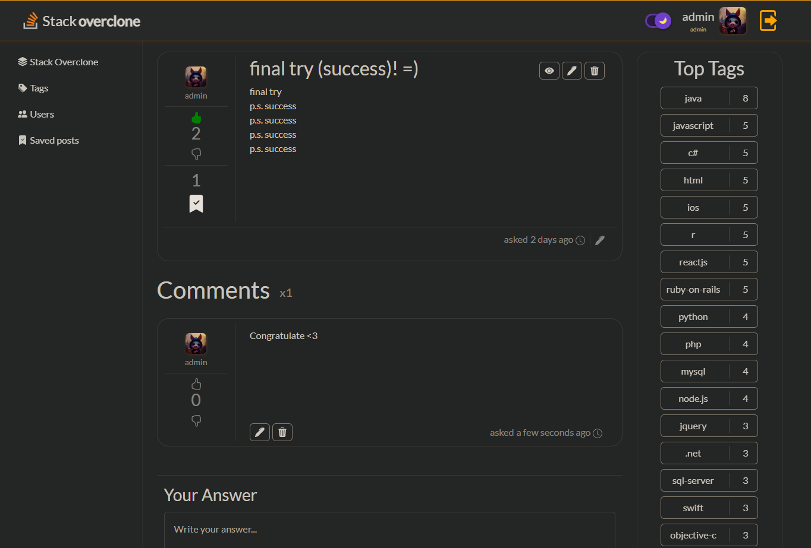
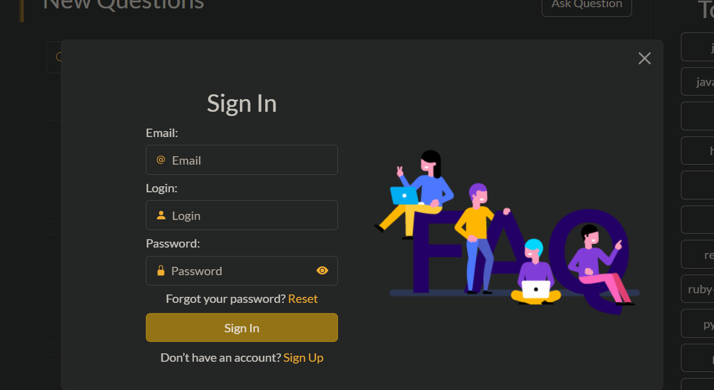
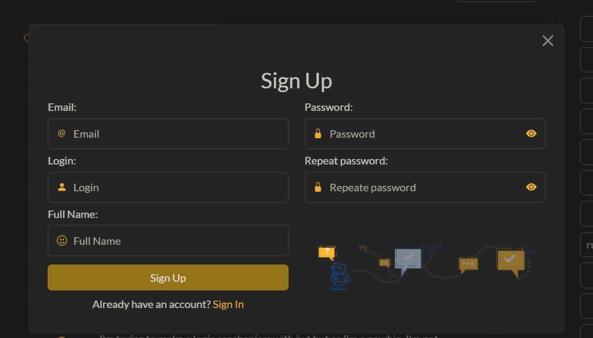
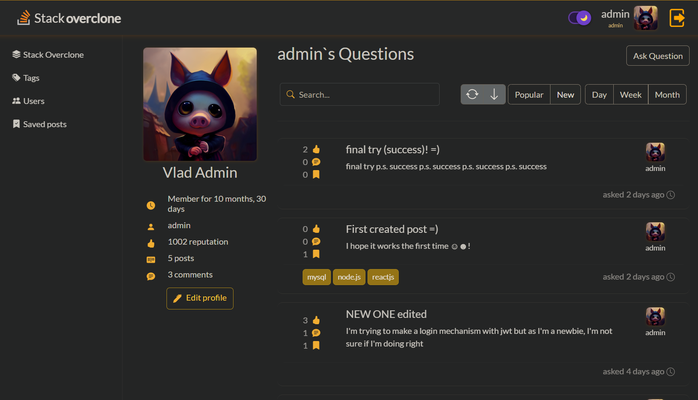
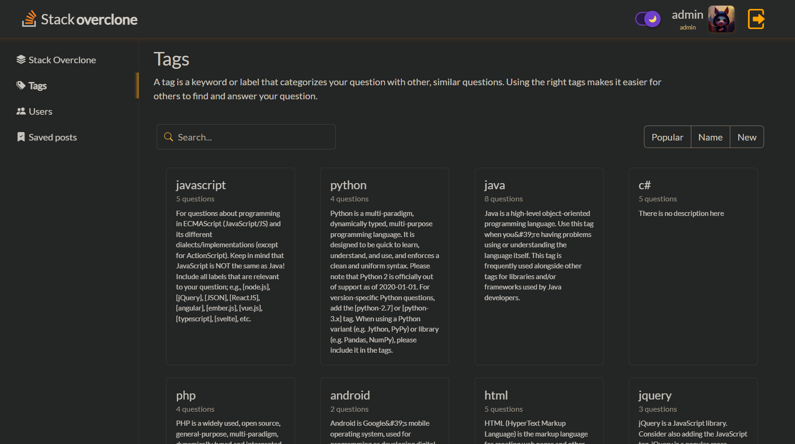
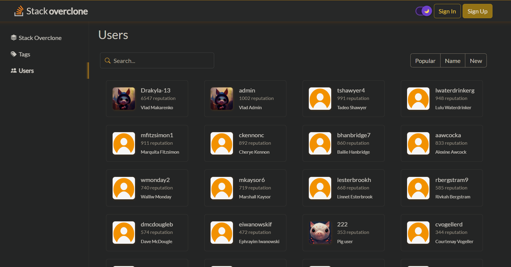
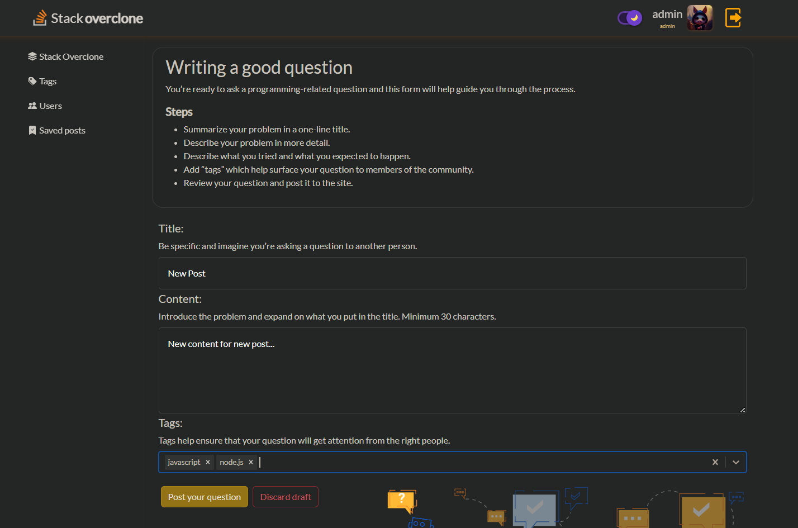

[](https://shields.io/)
[](https://shields.io/)
[](https://shields.io/)
[](https://shields.io/)
[](https://shields.io/)
[](https://shields.io/)

### [🌐 Website](https://useof.netlify.app/)  |  [📹 Demo Video]()

### API Hosted On
- __[stackoverclone.herokuapp]() (Primary)__

This project is a Q/A website for professional and enthusiast programmers built solely by me.

This repo consists of the Frontend and Backend code of the project.

## My Tech Stack (MERN)

#### Front-end

- Front-end Framework: `React.js (with Redux)`
- Styling: `Boorstrap`

#### Back-end

- For handling index requests: `Node.js with Express.js Framework`
- As Database: `MySQL with Sequelize`
- API tested using: `POSTMAN`

## Guidelines to setup

### Manual Setup

1. Open your local CLI:

   ```
   git clone https://github.com/Vlad-Makarenko/usof
   cd usof
   ```

2. Setup the backend code:
   
   __NOTE:__ For Frontend Developers, if they dont want to setup the Backend Code, they can skip the Step 2, and make sure they follow the optional step mentioned in Step 3

   - Create a `.env` file and the format should be as given in `.env.example`.
   - Go to the usof-backend directory & install the modules:

     ```
     cd usof-backend

     npm install
     ```

   - Run the server `npm start`.

3. Open a new CLI terminal and goto the root `usof-frontend` folder.
4. Setup the Frontend code -

   - Clone the code & install the modules:

     ```
     cd usof-frontend

     npm install
     ```

   - Run the client index `npm start`.

## Contributing

- Go to `Contributing.md`

## DEMO

#### VIDEO - [Watch the video]()


#### Main page

'

#### Post page

'

#### Sign in / Sign up forms

'
'

#### User page

'

#### Tags page

'

#### Users page

'

#### Ask page

'

<h2>Contact</h2>
<p>
<a href="https://github.com/Vlad-Makarenko"></a>
<a href="https://t.me/VladMakarenko"></a>
<a href="https://www.instagram.com/_vlad_makarenko_/"></a>
</p>