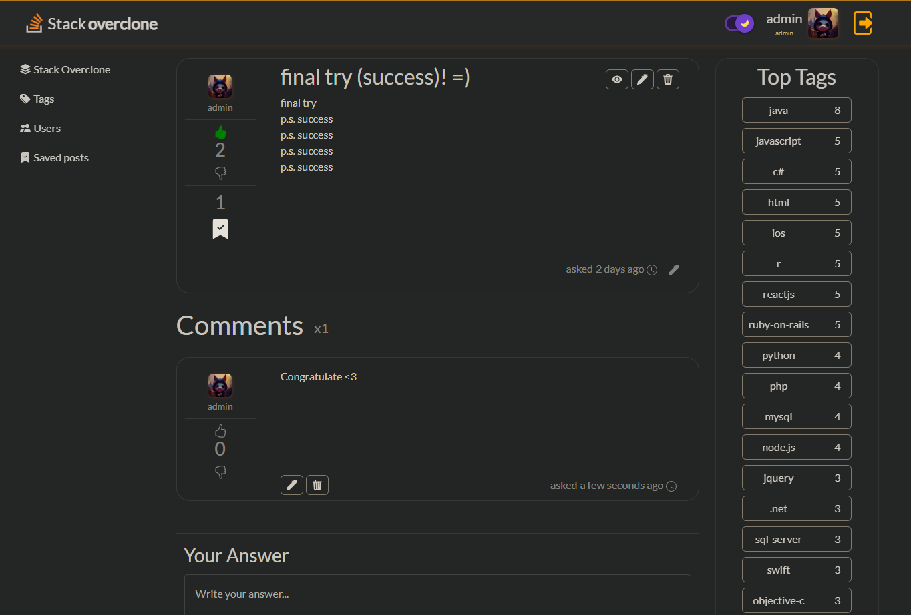
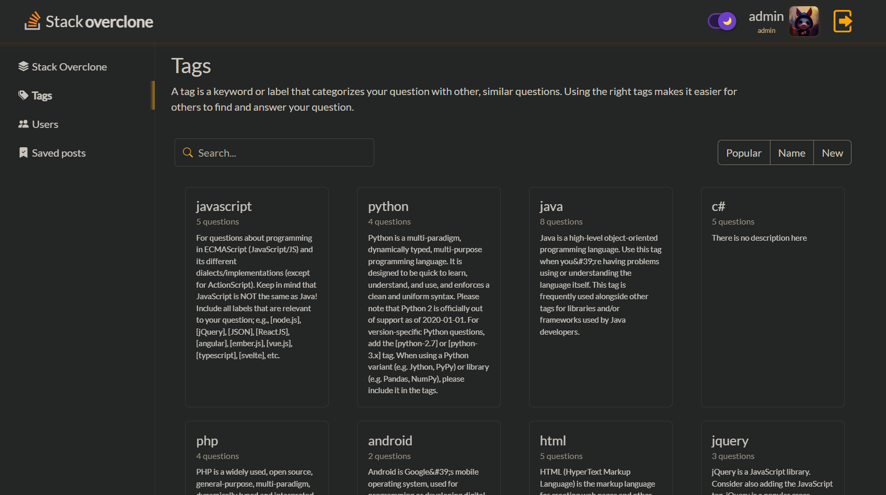
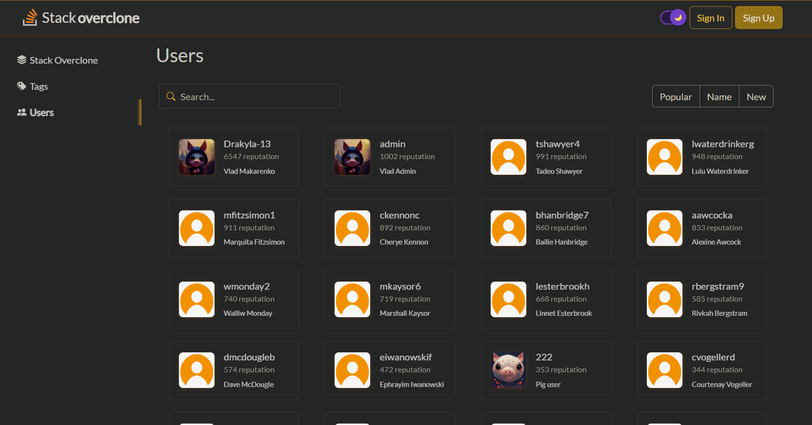

<h1>usof frontend</h1>

This project was done as a frontend part of the full-stack project for the ucode-connect

<h2>Technologies Used</h2>

<ul>
    <li>React</li>
    <li>Redux</li>
    <li>Bootstrap</li>
    <li>Axios</li>
</ul>
<h2>Setup</h2>

Clone down this repository. You will need node and npm installed globally on your machine.

 
Installation

`npm install`

To Start App:

`npm start`

To Visit App:

`http://localhost:5000/`

## DEMO

#### VIDEO - [Watch the video]()

#### Main page

'

#### Post page

'

#### Sign in / Sign up forms

'
'

#### User page

'

#### Tags page

'

#### Users page

'

#### Ask page

'

<h2>Contact</h2>

